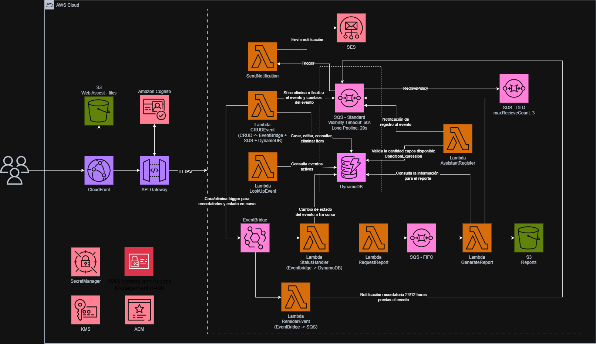

# EventApp — Plataforma de Gestión de Eventos en AWS

Aplicación serverless para la gestión de eventos académicos e institucionales, construida sobre AWS con infraestructura como código y despliegue continuo desde GitHub.

---

## Tabla de contenidos

1. [Descripción de la solución](#1-descripción-de-la-solución)
2. [Arquitectura](#2-arquitectura)
3. [Estructura del repositorio](#3-estructura-del-repositorio)
4. [Prerrequisitos](#4-prerrequisitos)
5. [Configuración de AWS](#5-configuración-de-aws)
6. [Configuración de GitHub](#6-configuración-de-github)
7. [Primer despliegue](#7-primer-despliegue)
8. [Verificar que todo funciona](#8-verificar-que-todo-funciona)
9. [Flujo de trabajo diario](#9-flujo-de-trabajo-diario)
10. [Descripción de los pipelines](#10-descripción-de-los-pipelines)
11. [Variables y parámetros de configuración](#11-variables-y-parámetros-de-configuración)
12. [Solución de problemas frecuentes](#12-solución-de-problemas-frecuentes)

---

## 1. Descripción de la solución

EventApp permite a dos tipos de usuarios interactuar con eventos:

- **Organizadores**: crean, editan, cancelan y finalizan eventos. Gestionan el ciclo de vida completo y pueden solicitar reportes de asistencia.
- **Asistentes**: exploran el catálogo de eventos activos y se inscriben, con control automático de cupos.

El sistema notifica por correo electrónico en cada acción relevante: confirmación de registro, recordatorios automáticos 24 h y 12 h antes del evento, actualización de datos, cancelación y agradecimiento al finalizar.

---

## 2. Arquitectura



**Autenticación:** Amazon Cognito con dos grupos (`Organizers`, `Attendees`).

**Infraestructura como código:** dos stacks de AWS CloudFormation:
- `data-stack.yml` — capa de datos (DynamoDB, SQS, S3 buckets)
- `app-stack.yml`  — capa de aplicación (Lambdas, API Gateway, Cognito, CloudFront)

---

## 3. Estructura del repositorio

```
eventapp/
├── .github/
│   └── workflows/
│       ├── deploy-data-stack.yml   # Pipeline: IaC capa de datos
│       ├── deploy-lambdas.yml      # Pipeline: código de funciones Lambda
│       ├── deploy-app-stack.yml    # Pipeline: IaC capa de aplicación
│       └── deploy-frontend.yml     # Pipeline: aplicación web Next.js
│
├── infrastructure/
│   ├── data-stack.yml              # CloudFormation: DynamoDB · SQS · S3
│   └── app-stack.yml               # CloudFormation: Lambdas · API GW · Cognito · CF
│
├── backend/
│   └── functions/
│       ├── crud_event/
│       │   ├── crud_event.py       # Crear, editar y eliminar eventos
│       │   └── requirements.txt
│       ├── assistant_register/
│       │   ├── assistant_register.py  # Registro atómico de asistentes (TransactWrite)
│       │   └── requirements.txt
│       ├── lookup_events/
│       │   ├── lookup_events.py    # Consulta de eventos (solo lectura)
│       │   └── requirements.txt
│       ├── status_handler/
│       │   ├── status_handler.py   # Transición de estado disparada por EventBridge
│       │   └── requirements.txt
│       ├── reminder_event/
│       │   ├── reminder_event.py   # Recordatorios 24h/12h disparados por EventBridge
│       │   └── requirements.txt
│       ├── send_notification/
│       │   ├── send_notification.py  # Envío de emails via SES (disparado por SQS)
│       │   └── requirements.txt
│       ├── request_report/
│       │   ├── request_report.py   # Solicitud de reporte (encola en SQS FIFO)
│       │   └── requirements.txt
│       └── generate_report/
│           ├── generate_report.py  # Generación de reporte (disparado por SQS FIFO)
│           └── requirements.txt
│
├── frontend/
│   ├── src/
│   │   ├── app/                    # Rutas Next.js (App Router)
│   │   │   ├── auth/login/         # Pantalla de login
│   │   │   ├── auth/registro/      # Registro de usuario
│   │   │   └── (dashboard)/
│   │   │       ├── organizador/    # Panel del organizador
│   │   │       └── asistente/      # Catálogo del asistente
│   │   ├── components/             # Componentes reutilizables
│   │   ├── services/               # Llamadas a la API Gateway
│   │   ├── providers/              # Contexto de autenticación
│   │   └── lib/                    # Cliente axios configurado
│   ├── next.config.ts
│   └── package.json
│
└── docs/
    ├── architecture/
    │   └── diagrama-arquitectura.png
    ├── caso-de-estudio.pdf
    ├── deployment.md
    └── lambda-test-payloads.jsonc  # Payloads de prueba para invocar Lambdas
```

---

## 4. Prerrequisitos

Antes de empezar, asegúrate de tener:

| Herramienta | Versión mínima | Para qué se usa |
|---|---|---|
| Git | 2.x | Clonar y versionar el repositorio |
| Cuenta AWS | — | Desplegar toda la infraestructura |
| Cuenta GitHub | — | Alojar el repositorio y ejecutar los pipelines |
| AWS CLI (opcional) | 2.x | Verificar recursos desde tu máquina local |

> No necesitas Node.js ni Python instalados localmente. El build del frontend y el empaquetado de las Lambdas ocurren dentro del runner de GitHub Actions.

---

## 5. Configuración de AWS

### 5.1 Elegir la región

Todos los recursos se desplegaran en una sola región. Esta guía usa **`us-east-2`** (Ohio). Si prefieres otra, deberás cambiar el valor de `AWS_REGION` en los 4 archivos de workflow antes de hacer el primer push:

| Archivo | Línea |
|---|---|
| `.github/workflows/deploy-data-stack.yml` | 19 |
| `.github/workflows/deploy-app-stack.yml` | 19 |
| `.github/workflows/deploy-lambdas.yml` | 19 |
| `.github/workflows/deploy-frontend.yml` | 23 |

En cada archivo, la línea tiene esta forma:

```yaml
AWS_REGION: us-east-2
```

Reemplaza `us-east-2` por el código de la región que desees (ej. `us-east-1`, `eu-west-1`).

### 5.2 Crear el usuario IAM para el pipeline

El pipeline de GitHub Actions necesita credenciales de AWS con permisos para crear y gestionar los recursos.

1. Ir a **AWS Console → IAM → Users → Create user**
2. Nombre: `github-actions-eventapp`
3. En **Set permissions** → **Attach policies directly** → buscar y seleccionar `AdministratorAccess`
4. Clic en **Create user**
5. Abrir el usuario recién creado → pestaña **Security credentials**
6. Clic en **Create access key** → seleccionar **Application running outside AWS**. Deje los parámetros por defecto y seleccione **Create access key**
7. **Guardar ambos valores** — solo se muestran una vez:
   - `Access key ID`
   - `Secret access key`

### 5.3 Verificar el email remitente en SES

Amazon SES requiere que el email desde el cual se envían notificaciones esté verificado.

1. Ir a **AWS Console → Simple Email Service → Identities → Create identity**
2. Seleccionar **Email address**
3. Ingresar el email que funcionará como remitente (ej. `notificaciones@tudominio.com`)
4. Clic en **Create identity**
5. Revisar la bandeja de entrada de ese email y hacer clic en el enlace de confirmación
6. Volver a la consola y verificar que el estado sea **Verified**

**Nota sobre el modo sandbox de SES:** Las cuentas AWS nuevas inician en modo sandbox, lo que significa que solo puedes enviar correos hacia emails también verificados. Para efectos de la implementación actual este sandbox es suficiente y para el registro de eventos se enviarán los correos desde y hacia la dirección registrada en el paso anterior.

---

## 6. Configuración de GitHub

### 6.1 Crear el repositorio

1. Ir a [github.com/new](https://github.com/new)
2. Configurar:
   - **Repository name:** `eventapp`
   - **Visibility:** `Private`
   - **No** inicializar con README ni ningún otro archivo
3. Clic en **Create repository**
4. Copiar la URL del repositorio (formato `https://github.com/<usuario>/eventapp.git`)

### 6.2 Configurar los Secrets

Los secrets son valores sensibles que el pipeline usa en tiempo de ejecución. Nunca se almacenan en el código.

Ir a: repositorio en GitHub → **Settings → Secrets and variables → Actions → New repository secret**

Crear los siguientes 3 secrets:

| Nombre | Valor | Origen |
|---|---|---|
| `AWS_ACCESS_KEY_ID` | El Access Key ID del paso 5.2 | AWS IAM |
| `AWS_SECRET_ACCESS_KEY` | El Secret Access Key del paso 5.2 | AWS IAM |
| `SES_FROM_EMAIL` | El email verificado en SES del paso 5.3 | Amazon SES |

---

## 7. Primer despliegue

### 7.1 Clonar y subir el repositorio

```bash
# Clonar el repositorio
git clone https://github.com/<usuario>/eventapp.git
cd eventapp

# O si ya tienes los archivos localmente, inicializar git y conectar:
git init
git branch -M main
git remote add origin https://github.com/<usuario>/eventapp.git

# Hacer el primer commit y push
git add .
git commit -m "feat: estructura inicial del proyecto EventApp"
git push -u origin main
```

El push activa automáticamente los 4 pipelines en paralelo, pero como es la primera vez y los recursos aún no existen, **debes ejecutarlos manualmente en el orden correcto** (los pipelines automáticos fallarán hasta que el Data Stack exista).

### 7.2 Ejecutar los pipelines en orden

Ir a **GitHub → tu repositorio → Actions**.

---

#### Paso A — Data Stack

**Actions → IaC — Data Stack → Run workflow**

| Campo | Valor |
|---|---|
| Branch | `main` |
| Ambiente de despliegue | `lab` |

Clic en **Run workflow**. Esperar que el job termine con estado verde (≈ 2 min).

Al terminar, en la pestaña **Summary** verás los nombres de los buckets S3 creados:
- `eventmanager-lambdas-<account_id>-lab` — bucket para ZIPs de Lambdas
- `eventmanager-reports-<account_id>-lab` — bucket para reportes generados

---

#### Paso B — Lambdas

**Actions → Lambdas — Empaquetar y subir → Run workflow**

| Campo | Valor |
|---|---|
| Branch | `main` |
| Ambiente de despliegue | `lab` |

Clic en **Run workflow**. Esperar que termine (≈ 1-2 min).

Este pipeline empaqueta cada función `.py` en su `.zip` y lo sube al bucket del paso anterior.

---

#### Paso C — App Stack

**Actions → IaC — App Stack → Run workflow**

| Campo | Valor |
|---|---|
| Branch | `main` |
| Ambiente de despliegue | `lab` |

Clic en **Run workflow**. Esperar que termine (≈ 3-5 min). Es el paso más largo porque crea Cognito, las 7 funciones Lambda, API Gateway y la distribución de CloudFront.

Al terminar, en el **Summary** verás:

| Recurso | Ejemplo de valor |
|---|---|
| API Gateway URL | `https://abc123.execute-api.us-east-2.amazonaws.com/lab/` |
| Frontend URL | `https://d1234abcdef.cloudfront.net` |
| CloudFront ID | `E1ABCDEFGHIJKL` |

---

#### Paso D — Frontend

**Actions → Deploy Frontend → Run workflow**

| Campo | Valor |
|---|---|
| Branch | `main` |
| Ambiente de despliegue | `lab` |

Clic en **Run workflow**. Esperar que termine (≈ 2-3 min).

Este pipeline:
1. Lee la URL del API Gateway directamente de los outputs de CloudFormation
2. Hace el build de Next.js inyectando esa URL como variable de entorno
3. Sube los archivos estáticos al bucket S3 del frontend
4. Invalida la caché de CloudFront para que los cambios sean inmediatos

Al terminar, el **Summary** muestra la URL pública de la aplicación.

---

## 8. Verificar que todo funciona

### 8.1 Abrir la aplicación

Copiar la **Frontend URL** del Summary del pipeline de frontend y abrirla en el navegador. Deberías ver la pantalla de login de EventApp.

### 8.2 Iniciar sesión — autenticación simulada

> **Nota:** La integración con Cognito está pendiente de implementación. El login actual es **simulado**: acepta cualquier email y contraseña. No es necesario crear usuarios en Cognito ni registrarse previamente.

El formulario incluye un **selector de rol** — elige directamente si entras como Organizador o Asistente, sin importar el email que uses.

> **Importante para recibir notificaciones:** SES en modo sandbox solo envía correos a direcciones verificadas en AWS. El email que ingreses en el login es el que el sistema usa como destinatario de notificaciones. Debes usar tu **email real verificado en SES** (ver sección 5.3).

**Escenario A — Un solo email para ambos roles** (recomendado para pruebas rápidas)

Verifica un único email en SES y úsalo en ambas sesiones cambiando solo el selector de rol:

| Sesión | Email | Contraseña | Rol seleccionado |
|---|---|---|---|
| Primera | `tucorreo@gmail.com` | `cualquier valor` | Organizador |
| Segunda | `tucorreo@gmail.com` | `cualquier valor` | Asistente |

**Escenario B — Dos emails distintos**

Verifica ambos emails en SES y úsalos así:

| Sesión | Email | Contraseña | Rol seleccionado |
|---|---|---|---|
| Primera | `tucorreo1@gmail.com` | `cualquier valor` | Organizador |
| Segunda | `tucorreo2@gmail.com` | `cualquier valor` | Asistente |

No es necesario registrarse previamente. El botón de registro también es simulado en esta versión.

### 8.3 Probar el flujo completo

1. Verificar en SES el email (o emails) que usarás — ver sección 5.3
2. Abrir la Frontend URL
3. Iniciar sesión con tu email verificado y seleccionar rol **Organizador**
4. Crear un evento con fecha futura
5. Cerrar sesión e iniciar sesión con rol **Asistente** (puede ser el mismo email)
6. Registrarse al evento
7. Verificar que llegó el email de confirmación de registro

### 8.4 Verificar los recursos en AWS Console

| Recurso | Dónde verificarlo |
|---|---|
| Tablas DynamoDB | DynamoDB → Tables → `EventsTable-lab` |
| Colas SQS | SQS → Queues → `EventNotificationsQueue-lab` |
| Funciones Lambda | Lambda → Functions → filtrar por `-lab` |
| API Gateway | API Gateway → APIs → `EventAPI-lab` |
| Distribución CloudFront | CloudFront → Distributions |
| User Pool Cognito | Cognito → User Pools → `EventUserPool-lab` |

---

## 9. Flujo de trabajo diario

Después del primer despliegue, cada push a `main` activa automáticamente solo el pipeline correspondiente a los archivos modificados.

| Si modificas… | Pipeline que se activa | Tiempo aproximado |
|---|---|---|
| `backend/functions/crud_event/crud_event.py` | Lambdas (solo esa función) | ~30 seg |
| `backend/functions/send_notification/send_notification.py` | Lambdas (solo esa función) | ~30 seg |
| Cualquier `.py` en `backend/functions/` | Lambdas (solo las modificadas) | ~30-60 seg |
| `infrastructure/data-stack.yml` | IaC — Data Stack | ~2 min |
| `infrastructure/app-stack.yml` | IaC — App Stack | ~3-5 min |
| Cualquier archivo en `frontend/` | Deploy Frontend | ~2-3 min |

### Desarrollar en una rama feature

```bash
# Crear una rama de trabajo
git checkout -b feature/nueva-funcionalidad

# Hacer cambios...
git add .
git commit -m "feat: descripción del cambio"
git push origin feature/nueva-funcionalidad

# Los pipelines NO se activan (solo observan la rama main)
# Cuando el PR es aprobado y se fusiona a main → sí se activan
```

### Agregar una nueva Lambda

1. Crear la carpeta y los archivos:
   ```bash
   mkdir backend/functions/nueva_funcion
   touch backend/functions/nueva_funcion/nueva_funcion.py
   touch backend/functions/nueva_funcion/requirements.txt
   ```

2. Agregar la función en `infrastructure/app-stack.yml` (recurso `AWS::Lambda::Function` y método en API Gateway si corresponde)

3. Agregar la función al mapa `AWS_NAMES` en `.github/workflows/deploy-lambdas.yml`:
   ```yaml
   [nueva_funcion]="NuevaFuncion-${ENV}"
   ```

4. Hacer commit y push — ambos pipelines (Lambdas y App Stack) se activarán.

### Agregar dependencias externas a una Lambda

Si una función necesita una librería que no está incluida en el runtime de Lambda (boto3 ya está disponible, no hace falta agregarlo):

```
# backend/functions/mi_funcion/requirements.txt
pydantic==2.7.0
requests==2.31.0
```

El pipeline detecta automáticamente que `requirements.txt` tiene contenido, instala las dependencias dentro del directorio de build y las incluye en el ZIP.

---

## 10. Descripción de los pipelines

### `deploy-data-stack.yml` — IaC Capa de Datos

**Se activa cuando:** cambia `infrastructure/data-stack.yml`

**Qué hace:**
1. Despliega el stack `EventApp-{env}-DataStack` con CloudFormation
2. Crea o actualiza: tabla DynamoDB, colas SQS (Standard + DLQ + FIFO), bucket de Lambdas, bucket de reportes
3. Muestra los nombres de los recursos creados en el Summary

**Cuándo ejecutarlo manualmente:** solo en el primer despliegue o cuando se modifica la arquitectura de datos.

---

### `deploy-lambdas.yml` — Código de funciones Lambda

**Se activa cuando:** cambia cualquier archivo `.py` en `backend/functions/`

**Qué hace:**
1. Detecta mediante `git diff` qué funciones específicas cambiaron
2. Para cada función modificada:
   - Copia el `.py` a un directorio de build limpio
   - Instala dependencias de `requirements.txt` si las hay
   - Empaqueta en `.zip` (sin `.pyc` ni `__pycache__`)
   - Sube el `.zip` al bucket S3
   - Llama a `aws lambda update-function-code` para aplicar el cambio inmediatamente
3. Si es el primer despliegue o ejecución manual, empaqueta todas las funciones

**Eficiencia:** si solo cambia `send_notification.py`, únicamente esa función se empaqueta y despliega. Las otras 7 no se tocan.

---

### `deploy-app-stack.yml` — IaC Capa de Aplicación

**Se activa cuando:** cambia `infrastructure/app-stack.yml`

**Qué hace:**
1. Verifica que el Data Stack exista (requisito previo)
2. Despliega el stack `EventApp-{env}-AppStack` con CloudFormation
3. Crea o actualiza: Cognito User Pool y grupos, IAM Role para Lambdas, 7 funciones Lambda, API Gateway (recursos y métodos), S3 frontend, distribución CloudFront
4. Expone en outputs: URL del API Gateway, nombre del bucket frontend, ID de CloudFront, URL pública

**Cuándo ejecutarlo manualmente:** primer despliegue o cuando se agrega/modifica un endpoint, nueva Lambda en el template, o cambio en Cognito.

---

### `deploy-frontend.yml` — Aplicación web Next.js

**Se activa cuando:** cambia cualquier archivo en `frontend/`

**Qué hace:**
1. Lee la URL del API Gateway directamente de los outputs de CloudFormation (no requiere configuración manual)
2. Instala dependencias con `npm ci`
3. Ejecuta `npm run build` con `NEXT_PUBLIC_API_GATEWAY_URL` inyectada
4. Sube archivos al S3 del frontend con headers de caché diferenciados:
   - Assets con hash (`_next/static/`): caché de 1 año (inmutable)
   - HTML y JSON: sin caché (actualizaciones inmediatas)
5. Crea una invalidación `/*` en CloudFront

---

## 11. Variables y parámetros de configuración

### Región de AWS

Definida en cada workflow como variable de entorno. Para cambiarla, editar los 4 archivos:

```yaml
# .github/workflows/deploy-*.yml
env:
  AWS_REGION: us-east-2   # ← cambiar aquí
```

### Ambiente de despliegue

Los stacks de CloudFormation se crean con el sufijo del ambiente (`lab`, `dev`, `prod`). Esto permite tener múltiples ambientes en la misma cuenta AWS con recursos completamente independientes.

Por defecto todos los pipelines usan `lab`.

### Parámetros del App Stack

Estos parámetros se pueden sobreescribir al desplegar sin modificar el template:

| Parámetro | Valor por defecto | Descripción |
|---|---|---|
| `Environment` | `lab` | Sufijo de todos los recursos |
| `LambdaRuntime` | `python3.12` | Runtime de todas las Lambdas |
| `LambdaTimeout` | `30` | Timeout en segundos |
| `LambdaMemory` | `256` | Memoria RAM en MB |
| `SesFromEmail` | *(del secret)* | Email remitente en SES |

Para modificar un parámetro de forma persistente, agregar su override en el paso de despliegue del workflow correspondiente:

```yaml
- name: Desplegar infrastructure/app-stack.yml
  run: |
    aws cloudformation deploy \
      --template-file infrastructure/app-stack.yml \
      --stack-name EventApp-${{ env.ENVIRONMENT }}-AppStack \
      --parameter-overrides \
        Environment=${{ env.ENVIRONMENT }} \
        SesFromEmail=${{ secrets.SES_FROM_EMAIL }} \
        LambdaMemory=512 \          # ← agregar aquí
        LambdaTimeout=60 \          # ← agregar aquí
      --capabilities CAPABILITY_IAM \
      --no-fail-on-empty-changeset
```

### Ciclo de vida de los estados de un evento

Las funciones Lambda reconocen los siguientes valores de estado:

| Estado en DynamoDB | Significado | Transición válida hacia |
|---|---|---|
| `PROGRAMADO` | Evento creado, aún no comenzó | `EN_CURSO`, `CANCELADO` |
| `EN_CURSO` | Evento en curso (transición automática por EventBridge) | `FINALIZADO` |
| `FINALIZADO` | Evento concluido | — |
| `CANCELADO` | Evento cancelado manualmente | — |

---

## 12. Solución de problemas frecuentes

### El pipeline "IaC — App Stack" falla con "Export not found"

**Causa:** el Data Stack no existe o está en estado de error.

**Solución:**
1. Ir a **AWS Console → CloudFormation → Stacks**
2. Buscar `EventApp-lab-DataStack`
3. Si no existe: ejecutar el pipeline `IaC — Data Stack`
4. Si está en `ROLLBACK_COMPLETE`: eliminarlo manualmente y volver a ejecutar el pipeline

---

### El pipeline de Lambdas muestra "SKIP" en todos los `update-function-code`

**Causa:** normal en el primer despliegue. Las funciones Lambda no existen aún porque el App Stack no se ha ejecutado.

**Solución:** ejecutar el pipeline `IaC — App Stack` después del de Lambdas. En despliegues posteriores el `update-function-code` funcionará correctamente.

---

### El build del frontend falla con error en `useSearchParams`

**Causa:** Next.js requiere que los componentes que usan `useSearchParams` estén envueltos en un `<Suspense>` para la exportación estática.

**Solución:** envolver el componente afectado:

```tsx
// frontend/src/app/(dashboard)/organizador/eventos/crear/page.tsx
import { Suspense } from 'react';

export default function Page() {
  return (
    <Suspense fallback={<div>Cargando...</div>}>
      <CrearEventoPage />
    </Suspense>
  );
}
```

---

### Los correos no llegan

**Causa más común:** SES está en modo sandbox.

**Diagnóstico:**
1. Ir a **SES → Account dashboard**
2. Verificar si dice "Your account is in the sandbox"
3. Si es así: verificar el email destinatario en **SES → Identities** o solicitar salida del sandbox

**Otras causas:**
- El email remitente no está verificado en SES → volver al paso 5.3
- La Lambda `send_notification` tiene un error → revisar **CloudWatch → Log groups → /aws/lambda/SendNotification-lab**

---

### CloudFront sigue sirviendo la versión anterior del frontend

**Causa:** la invalidación de caché puede tardar 1-2 minutos en propagarse globalmente.

**Solución:** esperar 2 minutos y refrescar con `Ctrl+Shift+R` (forzar recarga sin caché).

Si el problema persiste, verificar que la invalidación se creó correctamente:
1. **AWS Console → CloudFront → Distributions → tu distribución**
2. Pestaña **Invalidations** → verificar que existe una invalidación reciente con estado `Completed`

---

### Error "No se encontró el bucket de Lambdas" en el pipeline de Lambdas

**Causa:** el Data Stack no existe en la región configurada en el workflow.

**Solución:**
1. Verificar que `AWS_REGION` en los workflows coincide con la región donde desplegaste el Data Stack
2. Ejecutar primero el pipeline `IaC — Data Stack`

---

### La API Gateway devuelve 403 o CORS error desde el frontend

**Causa:** el despliegue del App Stack no incluyó el stage de API Gateway, o la URL configurada en el build del frontend está incorrecta.

**Diagnóstico:**
1. Ir a **API Gateway → APIs → EventAPI-lab → Stages**
2. Verificar que existe el stage `lab`
3. Copiar la URL del stage y compararla con `NEXT_PUBLIC_API_GATEWAY_URL` en el build del frontend (visible en el Summary del pipeline de frontend)

**Solución:** volver a ejecutar `IaC — App Stack` y luego `Deploy Frontend`.

---

## Licencia

Este proyecto fue desarrollado como parte de un reto académico de especialización en computación en la nube.